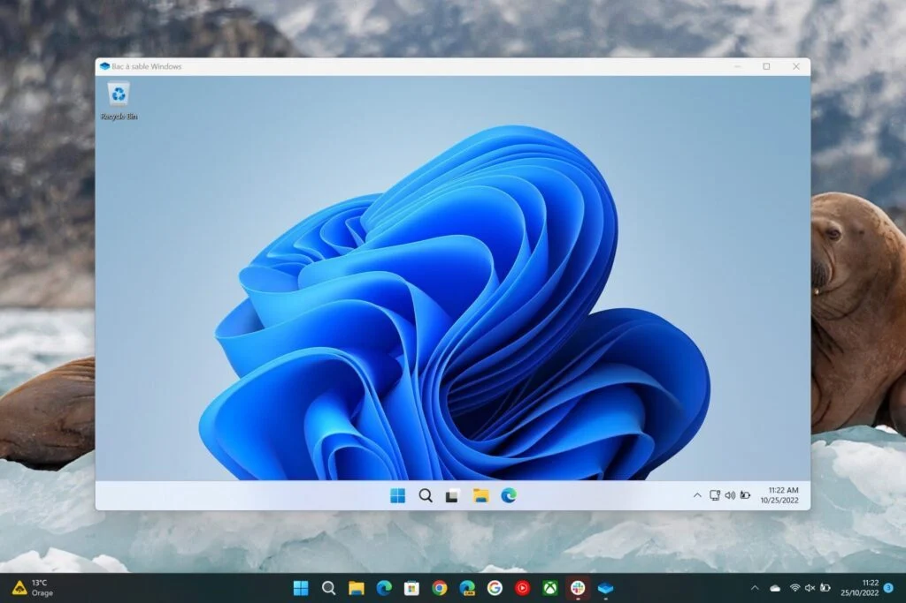
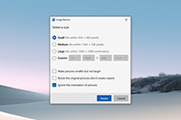
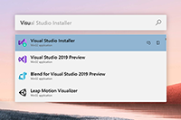
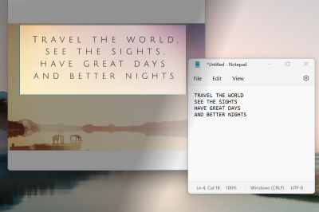
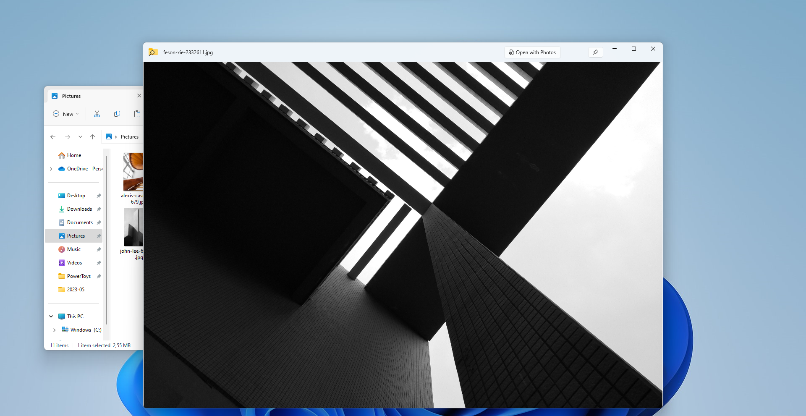

# Les outils numériques moderne au soutient de la recherche

Outils libres, gratuits et open source (sauf mention contraire)

Compatibilités indicatives

|             Icône              |               Signification               |
| :----------------------------: | :---------------------------------------: |
|  |              &ge; Windows 10              |
|  |              &ge; Linux 4.9               |
|  |              &ge; MacOS 10.8              |
|  | &ge; Firefox/Edge/Chrome 100, Safari 16.5 |

## Les indispensables

### [Winget](https://learn.microsoft.com/fr-fr/windows/package-manager/)

|   Catégorie   |                                         |
| :-----------: | :-------------------------------------- |
| Disponibilité |           |
|    Sources    | https://github.com/microsoft/winget-cli |
|     Type      | Logiciel                                |
|   Interface   | CLI                                     |

#### Installation

⚠️ Préinstallé sur Windows 10 2021 et ultérieur.

- [MS Store](https://apps.microsoft.com/store/detail/installeur-dapplications/9NBLGGH4NNS1)
- [GitHub](https://github.com/microsoft/winget-cli)

### Extras

- [winstall](https://winstall.app/) - Catalogue en ligne (et un peu plus)
  d'application pour winget.
- [winget ui](https://github.com/marticliment/WingetUI) - Interface graphique
  pour winget (`winget install wingetui`).

### Description

Gestionnaire de paquet windows. Installer des milliers d'applications à jour en
une ligne. Ne cherchez plus de douteux executable sur internet, toutes vos
application sont à portée de clavier. Mettez à jour toutes vos applications, **y
compris celles installées manuellement**, en un instant.

### Usage et examples

Chercher une application

```sh
winget search plot
```

Afficher les détails d'un paquet

```sh
winget show LabPlot2
```

Installer un paquet

```sh
winget install LabPlot2
```

Mettre à jour toutes vos applications (y compris celles installées manuellement)

```sh
winget upgrade --all
```

Afficher l'aide

```sh
winget -h
```

## Tester des applications en toute sécurité

### [Windows SandBox](https://learn.microsoft.com/fr-fr/windows/security/application-security/application-isolation/windows-sandbox/windows-sandbox-overview)

|   Catégorie   |                                |
| :-----------: | :----------------------------- |
| Disponibilité |  |
|    Sources    | Propriétaire, ~~open source~~  |
|     Type      | Logiciel                       |
|   Interface   | Graphique                      |

#### Installation

⚠️ disponible uniquement sur les éditions "Pro", "Entreprise", "Éducation"

⚠️ Activer la virtualisation dans le BIOS (souvent activée par défault),
activer la fonctionnalité "Bac à Sable" dans "Activer ou désactiver des
fonctionnalités Windows" ou dans powershell
`Enable-WindowsOptionalFeature -FeatureName "Containers-DisposableClientVM" -All -Online`

### Description

Bac à sable Windows fournit un environnement de bureau léger pour exécuter des
applications en toute sécurité de manière isolée. Les logiciels installés à
l’intérieur de l’environnement Bac à sable Windows restent « en bac à sable » et
s’exécutent séparément de l’ordinateur hôte.

Un bac à sable est temporaire. Lorsqu’il est fermé, tous les logiciels et
fichiers, ainsi que l’état, sont supprimés. Vous obtenez une nouvelle instance
du bac à sable chaque fois que vous ouvrez l’application.

### Usage et examples



## Améliorer son expérience utilisateur et ganger en productivité

### [Windows terminal](https://apps.microsoft.com/store/detail/windows-terminal/9N0DX20HK701)

|   Catégorie   |                                       |
| :-----------: | :------------------------------------ |
| Disponibilité |         |
|    Sources    | https://github.com/microsoft/terminal |
|     Type      | Logiciel                              |
|   Interface   | Graphique                             |

⚠️ Préinstallé sur windows 11

- [MS Store](https://apps.microsoft.com/store/detail/windows-terminal/9N0DX20HK701)
- [Winget](https://winstall.app/apps/Microsoft.WindowsTerminal) -
  `winget install Microsoft.WindowsTerminal`
- [GitHub](https://github.com/microsoft/terminal)

### Description

Le terminal Windows est une application de terminal moderne, rapide, efficace,
puissante et productive pour les utilisateurs d’outils en ligne de commande et
d’environnements tels que l’Invite de commandes, PowerShell et WSL. Ses
principales fonctionnalités incluent plusieurs onglets, des volets, une prise en
charge des caractères Unicode et UTF-8, un moteur de rendu de texte accéléré par
GPU, ainsi que des thèmes, styles et configurations personnalisés.

Sauvegardé des profils pour vous connecter en un clein d'oeil à tous vos
environnements.

### Usage et examples


### [PowerToys](https://learn.microsoft.com/fr-fr/windows/powertoys/)

|   Catégorie   |                                        |
| :-----------: | :------------------------------------- |
| Disponibilité |          |
|    Sources    | https://github.com/microsoft/PowerToys |
|     Type      | Logiciel                               |
|   Interface   | Graphique                              |

#### Installation

- [Winget](https://winstall.app/apps/Microsoft.PowerToys) -
  `winget install Microsoft.PowerToys`
- [GitHub](https://github.com/microsoft/PowerToys)

### Description

Microsoft PowerToys est un ensemble d’utilitaires permettant aux utilisateurs
chevronnés d’affiner et de simplifier leur expérience de Windows pour améliorer
leur productivité.

### Usage et examples

- **Image Resizer**

   Image Resizer est une
  extension du shell Windows, qui permet de redimensionner rapidement les
  images. D’un simple clic avec le bouton droit à partir de l’File Explorer,
  redimensionnez instantanément une ou plusieurs images.

- **Utilitaires de souris**

  

  Les utilitaires de souris ajoutent des fonctionnalités pour améliorer la
  souris et le curseur. Avec Trouver ma souris, localisez rapidement la position
  de votre souris avec un spot de lumière qui met en évidence votre curseur.

- **PowerRename**

  

  PowerRename vous permet de renommer, de rechercher et de remplacer en bloc des
  noms de fichiers. Doté de fonctionnalités avancées, il permet d’utiliser des
  expressions régulières, de cibler des types de fichiers spécifiques, de
  prévisualiser les résultats attendus et d’annuler les modifications.

- **Quick Accent**

  

  Quick Accent est une autre façon de taper des caractères accentués, utiles
  lorsqu’un clavier ne prend pas en charge cet accent spécifique avec une
  combinaison de touches rapide.

- **PowerToys Run**

  

  Recherchez un fichier/dossier, lancer une application, faîtes un calcul, une
  recherche web, ... instantanément. Pour l’ouvrir, utilisez le raccourci
  <kbd>Alt</kbd>+<kbd>Espace</kbd> et commencez à taper. Il s’agit d’un
  utilitaire open source et modulaire qui peut recevoir des plug-ins
  supplémentaires.

- **Text Extractor**

  

  Text Extractor est un moyen pratique de copier du texte à partir de n’importe
  où sur votre écran. Pour l’activer, utilisez le raccourci <kbd>⊞
  Win</kbd>+<kbd>Maj</kbd>+<kbd>T</kbd>.

- **Peek**

  

  Peek vous permet d’afficher un aperçu du contenu du fichier sans avoir à
  ouvrir plusieurs applications ou à interrompre votre workflow. Prévisualisez
  des images/videos ..., des pdf/word... . Sélectionnez simplement le fichier et
  utilisez le raccourci <kbd>Ctrl</kbd>+<kbd>Espace</kbd>

## Partager et collaborer

### [GitHub](https://github.com)

|   Catégorie   |                                |
| :-----------: | :----------------------------- |
| Disponibilité |  |
|    Sources    | Propriétaire, ~~open source~~  |
|     Type      | Service web                    |
|   Interface   | Graphique                      |

### Extras

- [Github CLI](https://cli.github.com/) - CLI pour gérer vos repositories at
  bien plus depuis votre machine (`winget install GitHub.cli`).
- [Gitlab](https://about.gitlab.com/) - Plateforme alternative.

### Description

Accédez et collaborez à des millions de projets Open Source et hébergez vos
projets Git. GitHub offre aussi la possibilité de créer un wiki et une page web
pour chaque dépôt. Le site offre aussi un système de suivi des bugs et propose
l'intégration d'un grand nombre de services externes tels que l'intégration
continue, la gestion de versions, badges, chat basés sur les projets, etc. via
l'option webhook.

### [Docker](https://docker.com)

|   Catégorie   |                                                                                              |
| :-----------: | :------------------------------------------------------------------------------------------- |
| Disponibilité |    |
|    Sources    | Propriétaire, ~~open source~~                                                                |
|   Interface   | Graphique, CLI                                                                               |

#### Installation

⚠️ Nécessite WSL 2 pour windows.

- [docker.com](https://www.docker.com/get-started/)
- [Winget](https://winstall.app/apps/Docker.DockerDesktop) -
  `winget install Docker.DockerDesktop`

### Extras

- [Podman](https://podman.io/) - Alternative open source compatible avec
  l'écosystème Docker (`winget install RedHat.Podman`).
- [Docker Hub](https://hub.docker.com/search?q=) - Catalogue de conteneurs.

### Description

Docker désigne plusieurs éléments, à savoir un projet d'une communauté Open
Source, les outils issus de ce projet Open Source, l'entreprise Docker Inc. qui
constitue le principal soutien de ce projet, ainsi que les outils que
l'entreprise prend officiellement en charge. Le fait que ce terme soit utilisé
aussi bien pour désigner les technologies que l'entreprise peut prêter à
confusion.

Voici les différentes définitions :

- Le logiciel Docker est une technologie de conteneurisation qui permet la
  création et l'utilisation de conteneurs Linux®.
- La communauté Open Source Docker a pour but d'améliorer ces technologies en
  faveur des utilisateurs.
- L'entreprise Docker Inc. s'appuie sur le travail de la communauté Docker pour
  développer ses produits. En échange, elle y contribue en renforçant la
  sécurité et en partageant ses avancées. Elle assure ensuite la prise en charge
  des technologies optimisées et renforcées pour les entreprises clientes.

Grâce à Docker, les conteneurs deviennent des machines virtuelles très légères
et modulaires qui vous offrent une grande flexibilité pour créer, déployer,
copier des conteneurs et les déplacer d'un environnement à un autre.

### Usage et examples

Lancer un conteneur linux avec un environnement R (laguage de programmation et
suite d'outils dédiés aux statistiques).

```sh
docker run --rm -it r-base
```

### [Git](https://git-scm.com/)

#### Installation

- [git-sm.com](https://git-scm.com/download/win)
- [Winget](https://winstall.app/apps/Git.Git) - `winget install Git.Git`

### Extras

- [GitKraken](https://winstall.app/) - Un des nombreux client graphique pour
  git. (`winget install Axosoft.GitKraken`).

### Description

Git est un logiciel de gestion de versions décentralisé.

### Usage et examples

Initialiser un repository

```sh
git init -b main
```

Ajouter des fichiers pour un commit

```sh
git add *
```

Commit les changements

```sh
git commit
```

Cloner un repository distant

```sh
git clone my_repository_url.git
```

Récupérer des changements depuis un repository distant vers une copie locale

```sh
git pull
```

Envoyer des changements vers un repository distant depuis une copie locale

```sh
git push origin main
```

Aficher l'aide

```sh
git help
```

## Tout Linux sous Windows

### [WSL](https://learn.microsoft.com/fr-fr/windows/wsl/about)

#### Installation

⚠️ Nécessite que la virtualisation soit activé dans le BIOS. :warning: Il
est préférable d'utiliser la version 2 (WSL 2), normalement par default pour les
nouvelles installations.

Installer une distribution Linux depuis le Microsoft Store (par exemple chercher
"linux").

Installer la distribution par default (Ubuntu)

```sh
wsl --install
```

### Extras

- [wsa](https://learn.microsoft.com/fr-fr/windows/android/wsa/) - Windows
  subsystem for android (toutes les apps android sous windows) nécessite Windows
  11 (préinstallé).

### Description

Le Sous-système Windows pour Linux permet aux développeurs d’exécuter un
environnement GNU/Linux (et notamment la plupart des utilitaires, applications
et outils en ligne de commande) directement sur Windows, sans modification et
tout en évitant la surcharge d’une machine virtuelle traditionnelle ou d’une
configuration à double démarrage.

### Usage et examples

- **Les applications graphiques installées sont disponible dans le menu
  démarrer**.
- **Si Windows Terminal est installé, un profil est automatiquement créé pour
  chaque distribution installée**.

Lancer la distribution par default

```sh
wsl
```

Aide

```sh
wsl --help
```

## Embarqué

### SSH

### Installation

Généralement préinstallé sur tous les OS.

### Description

Accès à distance à une machine via la ligne de commande.

- Raspberry Pi
- Redpitaya
- Server
- ...

### Usage et examples

Se connecter à un hôte

```sh
ssh user@host
```

Executer une commande à distance

```sh
ssh user@host 'command à executer'
```

Copier un fichier entre 2 machines distantes

```sh
# Copie vers server
scp local_filename user@host:destinatio/path/directory

# Copie depuis server
scp user@host:destinatio/path/directory/filename local_directory
```

Générer une clef de chiffrement pour la connection sans mot de passe

```sh
ssh-keygen
```

Copier une clef de chiffrement vers le server

```sh
scp ~/.ssh/id_rsa.pub user@host:~/.ssh/authorized_keys
```

## Développer et toute sérénité

### [VSCode](https://code.visualstudio.com/)

|   Catégorie   |                                                                                                                             |
| :-----------: | :-------------------------------------------------------------------------------------------------------------------------- |
| Disponibilité |     |
|    Sources    | https://github.com/microsoft/vscode                                                                                         |
|     Type      | Logiciel                                                                                                                    |
|   Interface   | Graphique                                                                                                                   |

### Installation

- [MS Store](https://apps.microsoft.com/store/detail/visual-studio-code/XP9KHM4BK9FZ7Q)
- [winget](https://winstall.app/apps/Microsoft.VisualStudioCode) -
  `winget install Microsoft.VisualStudioCode`

#### Extras

- [VSCodium](https://vscodium.com/) - Moins de télémétrie, modifié par la
  communauté (`winget install VSCodium.VSCodium`).
- [vscode.dev](https://vscode.dev/) - Editeur en ligne, sans installation.

### Description

Visual Studio Code est un éditeur de code gratuit, léger et extensible pour la
création d'applications Web, de bureau et mobiles, à l'aide de n'importe quel
langage et framework de programmation.

Visual Studio Code offre une prise en charge intégrée de la gestion du contrôle
des sources Git et de puissantes intégrations avec GitHub, un débogueur intégré
et une complétion de code intelligente avec IntelliSense et avec IntelliCode
piloté par l'IA.

Avec plus de 30 000 extensions et thèmes dans Visual Studio Code Marketplace,
vous pouvez personnaliser les fonctionnalités et l'apparence de Visual Studio
Code en fonction de vos besoins, de vos préférences et de votre style.

Vous pouvez utiliser Visual Studio Code pour créer n'importe quel type
d'application, pour le Web, le bureau et le mobile. Visual Studio Code prend en
charge JavaScript et TypeScript de manière native et propose des extensions pour
le codage dans des langages tels que Python, Java, C, ...

### Usage et examples


